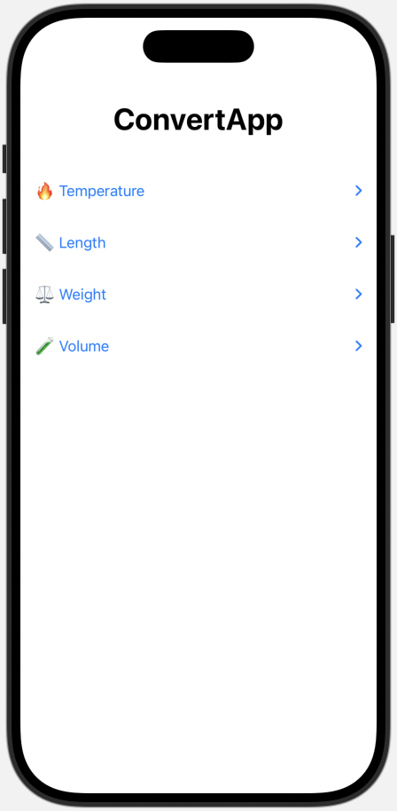

# ConvertApp 🌍📏

ConvertApp is a simple and user-friendly iOS application built with SwiftUI that allows users to perform various unit conversions with ease. The app provides individual sections for each conversion type, ensuring a clean and intuitive interface.

# Features

Temperature Conversion, Length Conversion.

# Interactive UI

Each conversion has its own dedicated section with an input field, conversion button, and real-time output. Scrollable interface for easy navigation between different conversions.

# How to Use

Open the app on your iOS device. Scroll to the desired conversion section (e.g., "Fahrenheit to Celsius"). Enter the value you want to convert in the input field. View the converted value displayed below the input. Repeat for other conversions as needed.

# Technologies Used

**SwiftUI**: For building the user interface.

**State Management**: SwiftUI's @State property wrapper is used to handle real-time updates to user input and converted values.

**Reusable Components**: Custom ConversionSection component for clean and modular code design.

# Installation

Clone or download the repository.

Open the project in Xcode (version 14.0 or higher recommended).

Build and run the project on a simulator or a physical device running iOS 16 or later.

# Project Structure

**ContentView.swift**: The main view of the app, which organizes and displays all conversion sections.

**ConversionSection**: A reusable SwiftUI component for individual conversion sections.

# Future Enhancements

Add support for additional unit conversions (e.g., volume, speed). Integrate a history log to store past conversions for user reference. Include localization for multiple languages.
